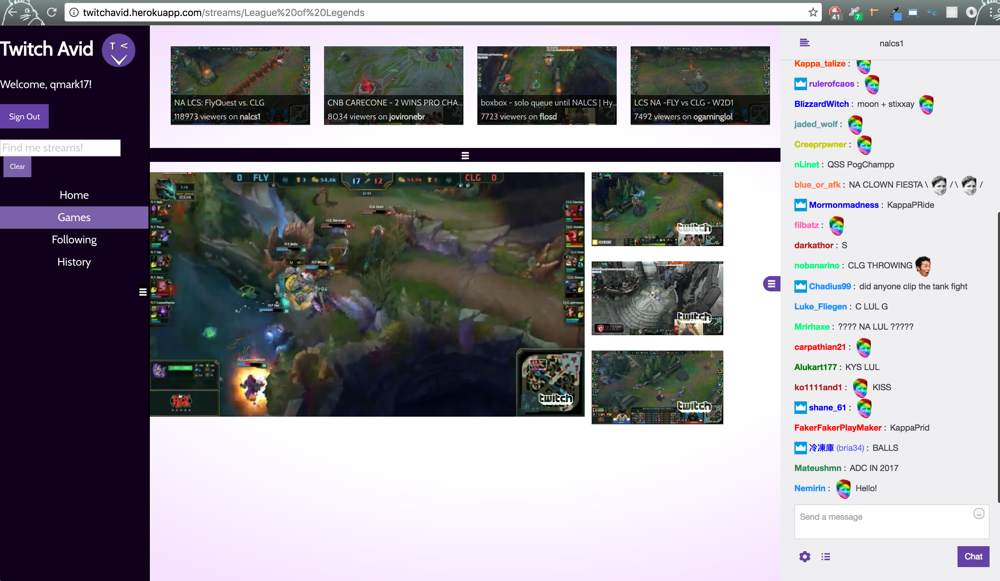

# TwitchAvid

[TwitchAvid](https://twitchavid.herokuapp.com)

TwitchAvid is a video streaming and chat app that focuses on gaming videos. TwitchAvid is an improvement upon the Twitch.tv website that is popular in the gaming community. Users can sign into their Twitch accounts, are able to search for videos by looking up their favorite games or gamers, and view up to 4 videos at a time. The main video is larger than the other 3 and this position can be switched with any of the 3 other videos. It has a chat function that is triggered when clicking on a specific video so that the user can communicate with the gaming community.

# Screenshots

Landing Page:
The page is easy to navigate with a sidebar, search field, chat area, and a top bar with the list of videos. The sidebar, chat, and top bar can be collapsed to increase the main video area in the center of the page.


The page with the top bar, sidebar, and chat toggled closed.


Games List:
When you click on Games in the sidebar, images of the most popular games on Twitch are displayed at the top of the page. The user can click on these images to view the video streams for the specific games. This can be toggled out of view.


Streams List:
The videos for each specific games will appear at the top and users can choose up to 4 videos to stream at the same time in the main area of the app.


Video Main Display:
The videos in the main area of the page are displayed in a 1 to 3 format so that 1 video is larger than the other 3. This can be switched when the user clicks on the main video and then clicks on one of the smaller videos to replace it.


Chat:
To be able to chat with the gaming community, click on Chat on the specific video and the chat will appear on the right. This can be toggled out of view.


Following:
The user can follow streams by clicking on Follow on the videos being displayed. They can also unfollow the stream by clicking on Unfollow. To view the streams that the user is currently following, the user can click on Following in the sidebar and it will appear in the top bar.

The user clicking on follow.


The user clicking on unfollow.


The user clicking on Following in the sidebar.


History:
The user's history is saved and the gamers they have viewed will appear in the top bar when they click on History in the sidebar.


# Technologies

TwitchAvid uses a number of open source projects to work properly:

* [React](https://facebook.github.io/react/) - declarative, efficient, and flexible JavaScript library for building user interfaces!
* [Node.js](https://nodejs.org/en/) - evented I/O for the backend
* [Express](http://expressjs.com/) - fast node.js network app framework
* [React Foundation](https://react.foundation/) - css framework for React
* [React CSS Transition Group](https://facebook.github.io/react/docs/animation.html) - add-on component for easily implementing basic CSS animations and transitions
* [MongoDB](https://www.mongodb.com/) - noSQL database
* [Babel](https://babeljs.io/) - JSX compiler


# Installation

TwitchAvid requires [Node.js](https://nodejs.org/) v4+ and MongoDB to run.

Download/fork the repository [TwitchAvid repo](https://github.com/mconstanza/TwitchAvidReact).

Install the dependencies in the root and client directory. 

There are two servers: 1. A Webpack development server and 2. a node server for API calls. Run 'npm start' to start both servers and run the app.

Go to localhost:3000 on your browser to view.

```sh
$ cd TwitchAvidReact
$ npm install
$ cd client
$ npm install
$ cd ..
$ npm start
```

# Authors

* [Michael Amon](https://github.com/mikedeleamon)
* [Isabell Chang](https://github.com/ychang21)
* [Michael Constanza](https://github.com/mconstanza)
* [Yuuta Sumioka](https://github.com/ysumio120)
* [Vikas Sundrani](https://github.com/Wintermutate)

# Acknowledgements

* The team for countless hours of work and dedication.
* Special thanks to Yuuta for the idea and foundation.

